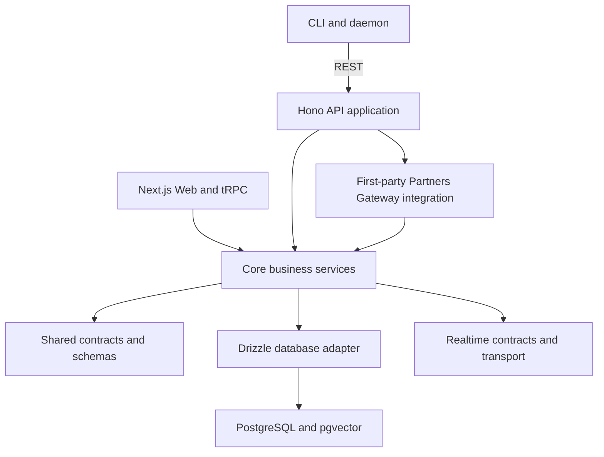

# Task Weaver Design Document

> A project management tool for human–AI collaboration, where humans and AI agents work together in one platform.

[简体中文](design.zh-CN.md)

## 1. Project Overview

Task Weaver is a project management platform for human–AI collaboration. Humans use the Web UI, and AI agents use the REST API. Both are equal participants sharing the same data and business logic.

### 1.1 Core Capabilities

- **Project management:** Create and manage projects, each with its own requirements, tasks, and kanban board.
- **Requirement management:** Requirements belong to projects; tasks belong to requirements; requirements can link bidirectionally to documents.
- **Task system:** Manage the full task lifecycle, status changes, dependencies, notes, and comments.
- **Knowledge base:** Support global and project documents, bidirectional document links, many-to-many task and requirement links, and document versions.
- **Hybrid search:** Combine exact keyword search with vector semantic search.
- **Realtime collaboration:** Humans and agents can follow each other's progress.
- **MCP registry:** Register external MCP servers and proxy calls to their tools.
- **Memory:** Store and retrieve agent memories.
- **Skills:** Import skill files into the database and discover them by intent.
- **Daemon:** Register CLI daemons, send heartbeats, and claim work with leases.
- **Webhooks:** Deliver event-driven notifications with retries.

### 1.2 Principles

- **Equal interfaces:** Humans and agents use the same business logic.
- **Flexible workflows:** Task statuses can change freely rather than following a mandatory linear sequence.
- **Useful links:** Bidirectional links between documents, tasks, and requirements form a knowledge network.
- **Incremental complexity:** One PostgreSQL instance is sufficient to start; expand when needed.

---

## 2. System Architecture

### 2.1 Architecture Diagram



### 2.2 Monorepo Layout

```text
task-weaver/
├── apps/
│   ├── web/                    # Next.js frontend and Web composition
│   ├── api/                    # Hono API and module lifecycle composition
│   └── cli/                    # CLI and daemon
├── packages/
│   ├── contracts/              # Shared schemas, types, and event contracts
│   ├── core/                   # Business services and default runtime adapters
│   ├── db/                     # Drizzle schema, Core and extension migrations
│   ├── partners-gateway/       # Independently composed reference module
│   └── realtime/               # Realtime event types and pub/sub transport
├── skills/                     # Agent Skills packages
├── docs/                       # English documents and separate translations
├── turbo.json                  # Turborepo configuration
├── pnpm-workspace.yaml         # pnpm workspace configuration
└── package.json
```

### 2.3 Technology Choices

| Layer | Technology | Rationale |
|-------|------------|-----------|
| Build and monorepo | Turborepo + pnpm | Caching, parallel builds, and dependency isolation |
| Backend | Hono | Native TypeScript, small footprint, and runtime portability |
| Database | PostgreSQL + pgvector | JSONB documents, `tsvector` full-text search, vector search, and LISTEN/NOTIFY |
| ORM | Drizzle ORM | Type safety and a lightweight SQL-like API |
| Frontend API | tRPC v11 | End-to-end types and SSE subscriptions |
| General API | REST with Hono routes | Language-agnostic HTTP/JSON access |
| GraphQL | Hono route | Flexible queries |
| Frontend | Next.js 16 App Router | React Server Components and file-based routing |
| UI | shadcn/ui + Tailwind CSS | Editable components built on accessible Radix primitives |
| Validation | Zod | Shared schemas across tRPC and REST |
| Document editing | Markdown with CodeMirror, react-markdown, and Mermaid | Agent-friendly content, wiki links, and diagrams |
| Embeddings | OpenAI `text-embedding-3-small` or a replacement | 1536-dimensional vectors at low cost |

---

### 2.4 Unified application and deferred plugin planning

Task Weaver has one application, without a separate CE/Pro product architecture.
Contracts, Core, database, realtime and Partners Gateway packages still support
existing functionality. The old in-process module SDK, default licensing/access
ports, Web extension registry and extension migration runner are removed.
API/Web assemble built-in functionality directly; only Core migrations run.
API-key validation and actor conventions remain unchanged. The removed default
access ports allowed every request; they were not an implemented role system.

Partners Gateway retains status/health endpoints, worker lifecycle, idempotent
retries and lease recovery. `pnpm test:gateway-postgres` verifies disposable
PostgreSQL and Gateway HTTP/SSE transport; `pnpm test:gateway-live` requires
explicit test endpoints/credentials. The default worker does not invoke an AI model.

Plugin work is a low-priority draft, not current implementation. Additional
foundation features are not planned in this transition. Future third-party code
runs in separate processes/containers without host database connections, arbitrary
SQL or access to other plugin data. Host-brokered APIs and plugin-owned storage
enforce the intersection of plugin grants and user/project access. Frontend
isolation uses narrow bridges without host tokens. Permission declarations alone
are not isolation; the old trusted official-code model is not a third-party sandbox.

See [architecture transition](architecture-transition.md),
[deferred plugin roadmap](plugin-roadmap.md) and [versioned packages](ce-packages.md).

## 3. Data Model

### 3.1 Entity Relationships

```text
┌──────────┐       ┌────────────────┐       ┌──────────────┐
│ projects │──1:N──│ requirements   │──1:N──│    tasks      │
└────┬─────┘       └───────┬────────┘       └──────┬───────┘
     │                     │                       │
     │              ┌──────┴───────┐         ┌─────┴──────┐
     │              │ doc_req_links│         │  comments  │
     │              └──────────────┘         ├────────────┤
     │                                       │  task_deps │
     │                                       ├────────────┤
     │                                       │ task_notes │
     │                                       ├────────────┤
     │                                       │ status_log │
     │                                       └────────────┘
     │
     └──1:N──┌──────────────┐    ┌──────────────┐
             │  documents   │    │   memories   │
             └──────┬───────┘    └──────────────┘
                    │
              ┌─────┴──────┐    ┌──────────────────┐
              │  doc_links │    │ document_versions│
              └────────────┘    └──────────────────┘

Other project-visible or independent entities:
┌──────────────┐  ┌──────────────┐  ┌──────────────┐  ┌──────────────┐
│  mcp_servers │  │   daemons    │  │   webhooks   │  │   api_keys   │
├──────────────┤  └──────────────┘  ├──────────────┤  └──────────────┘
│  mcp_tools   │                    │  deliveries  │
├──────────────┤                    └──────────────┘
│mcp_tool_calls│
└──────────────┘
```

Core constraints:

- Every requirement belongs to a project.
- Project tasks belong to a requirement in the same project; personal tasks use `scope = personal` and owner fields.
- Documents can be global or project-scoped.
- `docType` identifies `requirement`, `design`, `meeting`, `guide`, `reference`, `skill`, or `other` documents.
- `document_versions` stores version history for optimistic concurrency control.
- Retrieval assets (MCP tools, Skills, and Memories) share global, project, personal, actor, node, and client scopes.

### 3.2 Core Tables

Detailed fields live in `packages/db/src/schema/`. The main tables are:

| Table | File | Purpose |
|-------|------|---------|
| `projects` | `projects.ts` | Projects with `active` or `archived` status |
| `requirements` | `requirements.ts` | Requirements with `draft`, `approved`, `in_progress`, `in_review`, `ready_to_merge`, `done`, `cancelled`, or `archived` status |
| `tasks` | `tasks.ts` | Project or personal tasks with `todo`, `in_progress`, `in_review`, `done`, or `cancelled` status |
| `task_status_log` | `tasks.ts` | Task status history |
| `task_dependencies` | `tasks.ts` | Task dependencies: `blocks` or `related` |
| `requirement_dependencies` | `requirements.ts` | Requirement dependencies: `blocks` or `related` |
| `execution_slices` | `requirements.ts` | Ordered execution slices within a requirement lane |
| `task_comments` | `tasks.ts` | Task comments |
| `task_notes` | `tasks.ts` | Task notes |
| `documents` | `documents.ts` | Knowledge base documents and metadata |
| `document_versions` | `documents.ts` | Document version history |
| `document_links` | `documents.ts` | Bidirectional document links |
| `document_task_links` | `documents.ts` | Document-to-task links |
| `document_requirement_links` | `documents.ts` | Document-to-requirement links |
| `memories` | `memories.ts` | Agent memories: `user`, `feedback`, `project`, `reference`, or `other` |
| `mcp_servers` | `mcp-servers.ts` | External MCP server registry |
| `mcp_tools` | `mcp-servers.ts` | Synchronized MCP tool list |
| `mcp_tool_calls` | `mcp-servers.ts` | MCP tool call records |
| `skill_packages` | `skill-packages.ts` | Skill package identity and scope metadata |
| `skill_package_versions` | `skill-packages.ts` | Immutable package versions and storage summaries |
| `skill_package_storage_objects` | `skill-packages.ts` | Server-managed archive and file objects |
| `skill_package_files` | `skill-packages.ts` | Versioned file manifest, hashes, flags, and indexed document links |
| `daemons` | `daemons.ts` | Daemon registry, heartbeats, capabilities, and active workers |
| `requirement_claims` | `requirements.ts` | Distributed requirement-lane leases |
| `repositories` | `repositories.ts` | Repository identities, endpoints, visibility, and non-secret auth policy |
| `requirement_repositories` | `repositories.ts` | Requirement workspaces and repository delivery state |
| `task_repositories` | `repositories.ts` | Optional task hints within a requirement workspace |
| `schedules` | `schedules.ts` | One-off and recurring task templates |
| `schedule_runs` | `schedules.ts` | Idempotent occurrences and generated task links |
| `ti_model_configs` | `ti-agent.ts` | Owner-scoped Ti model configuration |
| `ti_agent_policies` | `ti-agent.ts` | Owner-scoped Ti execution controls |
| `ti_agent_runs` | `ti-agent.ts` | Ti queue, leases, and audit records |
| `assistant_conversations` | `assistant.ts` | Contextual assistant sessions |
| `assistant_messages` | `assistant.ts` | Dialog messages, context snapshots, and Ti metadata |
| `assistant_actions` | `assistant.ts` | Action proposals, approvals, results, and audit links |
| `webhooks` | `webhooks.ts` | Webhook configuration, URLs, events, and secrets |
| `webhook_deliveries` | `webhooks.ts` | Webhook deliveries and retries |
| `api_keys` | `api-keys.ts` | API key management |
| `activity_log` | `activity.ts` | Global activity history |

---
### 3.3 Assistant Dialog Foundations

The contextual assistant is a management copilot backed by bounded Task Weaver context and Ti execution records. Conversation storage is separate from task comments so exploratory chat does not pollute durable task history, while important outcomes can still be linked back through action targets and activity log entries.

- `assistant_conversations` stores the dialog session and its current UI context: global, project, requirement, task, or schedule.
- `assistant_messages` stores user/assistant/system/tool messages, optional context snapshots, and provider/model metadata for Ti-backed answers.
- `assistant_actions` stores machine-readable proposals such as task creation, task updates, schedule changes, Ti run queueing, comments/notes, and document drafts.
- Proposed actions start in `proposed`. Human approval moves them through `approved` and `executing`; execution status, result payloads, validation errors, and target entity references are recorded for replay/debugging. Automatic execution stays disabled until policy controls explicitly allow it.
- The first approved action set covers creating tasks, updating task status/priority/content fields, creating or pausing schedules, queueing Ti runs, adding task comments/notes, and creating reviewable document drafts.
- Management workflows provide focused prompts for project health, stale task follow-up, failed Ti run triage, schedule maintenance, requirement next steps, and personal inbox cleanup. They may return read-only analysis plus structured action proposals that remain approval-gated.
- Assistant automatic maintenance is controlled through owner-scoped Ti policy fields and is disabled by default. Policy controls include dry-run/live mode, action allowlists, per-day action limits, timeout/retry settings, and routing uncertain actions to review.
- `buildAssistantContext` assembles bounded context from project state, current artifacts, schedules, activity, documents, memories, MCP tools, Ti policy, failed Ti runs, and recent conversation messages. It applies item limits, text truncation, and simple secret-key redaction before passing data to a model.

---

### 3.4 Scheduled and Recurring Task Model

Scheduled work is modeled as templates plus occurrence runs:

- `schedules` stores the durable definition for one-off scheduled jobs and recurring templates.
- `schedule_runs` stores each planned occurrence, its idempotency key, generated task link, and execution/audit outcome.
- Generated work remains a normal `tasks` row, so existing task status, claim, daemon, realtime, webhook, and activity-log flows continue to apply.

#### Schedule Template

| Field | Meaning |
|-------|---------|
| `projectId` | Project target for project-scoped schedules. Nullable for future personal schedules. |
| `requirementId` | Requirement used when generating project tasks. Nullable so schedules can survive requirement reshaping. |
| `targetScope` | `project` or `personal`. Project schedules generate project tasks under a requirement; personal schedules generate owner-scoped personal tasks. |
| `kind` | `one_off` or `recurring`. |
| `status` | `active`, `paused`, or `archived`. Only active schedules with `nextRunAt` due are scheduler candidates. |
| `timezone` | IANA timezone used to interpret local calendar rules such as "every weekday at 09:00". |
| `startsAt` / `endsAt` | Inclusive start and optional end boundary for generation. Stored as UTC instants. |
| `nextRunAt` | Next due UTC instant, precomputed after create/update and advanced after each run. |
| `recurrenceSyntax` / `recurrenceRule` | Recurring schedules use RRULE as the canonical syntax. Cron may be accepted as an import/compatibility syntax but should be normalized or clearly labeled. |
| `taskTitle` / `taskDescription` / `taskPriority` | Task template copied into generated task instances. |
| `autoRun` | Whether generated tasks should be offered to execution immediately instead of only being created for human review. |
| `assignedExecutor` / `assignedExecutorType` | Optional explicit executor target for generated work. This supports future server-side assigned agents without letting them claim arbitrary daemon lanes. |
| `requestedTiProvider` / `requestedTiModel` | Optional Ti model request carried to generated runs. Runtime fallback to the user's default Ti model is resolved by the execution layer, not by schedule generation. |

#### Schedule Run

Each run is uniquely identified by `(scheduleId, plannedFor)`, which prevents duplicate task generation when schedulers race or restart. `plannedFor` is the UTC instant for the occurrence, after applying the template timezone and recurrence rule.

Run statuses:

| Status | Meaning |
|--------|---------|
| `pending` | Occurrence was reserved but has not produced a task or terminal result yet. |
| `created` | A normal task was created and linked through `generatedTaskId`. |
| `skipped` | Occurrence was intentionally skipped, for example outside expiry/catch-up policy. |
| `failed` | Scheduler attempted the occurrence but could not create or route work. |
| `cancelled` | Human or system cancelled the occurrence before generation. |

The run stores both requested and actual Ti provider/model fields. Requested values are copied from the schedule at generation time. Actual values are filled by the assigned execution component after fallback and provider availability checks. This keeps audit history stable even if the user's default model later changes.

#### Recurrence Rules

RRULE is the preferred stored format because it represents calendar recurrence with timezone-aware local semantics better than cron. Cron remains useful for operational imports and simple server-side schedules, but cron expressions are ambiguous around timezone and daylight-saving transitions unless paired with `timezone`.

`nextRunAt` is always stored as a UTC timestamp. Scheduler code should compute it by:

1. Interpreting `startsAt`, `endsAt`, and the recurrence rule in `timezone`.
2. Selecting the next occurrence strictly after the last completed or skipped planned occurrence.
3. Converting that occurrence to UTC for `nextRunAt`.
4. Setting `nextRunAt = null` when a one-off schedule has run, the rule is exhausted, or the schedule is archived.

Catch-up and expiry policy is intentionally separate from the core schedule identity. The follow-up scheduler policy task should define whether missed occurrences create all runs, latest-only runs, no runs, or skipped `schedule_runs` records.

---

### 3.5 Server-Side Ti Agent Boundary

Ti is the server-side Task Weaver agent: a bounded assigned-automation worker with a private execution adapter behind it. It is not the same execution path as `tw daemon`, and it must not claim arbitrary requirement lanes or project coding work.

Allowed work:

- Tasks explicitly assigned to the server-agent identity, currently `task-weaver:ti-agent`.
- Schedule runs whose generated task is explicitly assigned to that identity.
- Lightweight automations such as reminders, summaries, metadata maintenance, and safe registered tool calls.

Disallowed work:

- Competing with requirement-lane daemons for unassigned project tasks.
- Running arbitrary repository edits outside an explicit assigned task/run.
- Using machine-global Ti credentials as the product authorization model.
- Executing unattended Ti sessions without Task Weaver-owned timeouts, rate limits, logging, and isolation.

Product naming:

- Stable internal actor id: `task-weaver:ti-agent`.
- Default display label: `Ti Agent`.
- UI category label: `Assigned Automations`.
- The display label is product copy, not an architectural dependency. It can be changed later without changing task assignment, audit, or policy records.

#### Ti Model Configuration

`ti_model_configs` stores the models a user or agent owner may use through Ti:

| Field | Meaning |
|-------|---------|
| `ownerId` / `ownerType` | User or agent that owns this Ti model configuration. |
| `provider` / `model` | Ti provider and model identifiers. |
| `label` | Optional human-readable label. |
| `apiKeyRef` | Reference to stored credentials, not raw secret material. |
| `credentialStatus` | `unknown`, `valid`, `invalid`, or `missing`. Invalid and missing configs are not usable. |
| `enabled` | Disabled configs cannot be selected or used as fallback. |
| `isDefault` | One default model per owner, enforced by a partial unique index. |
| `capabilities` / `costMetadata` | Optional metadata copied from the Ti model catalog or internal policy. |

Runtime model resolution uses the requested provider/model when it is configured, enabled, and has usable credentials. Otherwise it falls back to the owner's default usable model, then to the first usable model. If no model is requested and no usable model exists, execution is rejected before a run is queued.

#### Ti Agent Runs

`ti_agent_runs` is the execution queue and audit record. A run must reference at least one explicit target: `taskId` or `scheduleRunId`.

Run statuses:

| Status | Meaning |
|--------|---------|
| `queued` | Run is ready for the server-side agent but not leased. |
| `running` | A worker has acquired a lease and may execute Ti. |
| `succeeded` | Execution completed successfully. |
| `failed` | Execution failed after the current attempt. |
| `in_review` | Execution produced uncertain or policy-sensitive output for human review. |
| `cancelled` | Run was cancelled before completion. |

Each run records requested and actual Ti provider/model, fallback reason, optional Ti session id, event log, output summary, error message, retry counters, cost metadata, lease owner, lease expiry, and timestamps. The first implementation only queues and audits runs; the actual execution loop must be added behind an isolation boundary.

#### Ti Execution Policy

`ti_agent_policies` is owner-scoped and disabled by default. It controls whether queued runs can be acquired and how far execution may go:

| Field | Meaning |
|-------|---------|
| `enabled` | Worker acquisition is rejected unless this is true. |
| `executionMode` | `disabled`, `dry_run`, or `live`. Dry-run workers lease and audit runs without invoking Ti. |
| `maxConcurrentRuns` | Maximum active leases for the owner/agent. |
| `dailyRunLimit` / `monthlyRunLimit` | Hard run acquisition limits. Zero means no runs for that period. |
| `runTimeoutSeconds` | Maximum execution budget for a worker process. |
| `defaultMaxRetries` | Default retry budget copied into new runs when not specified. |
| `toolAllowlist` / `toolDenylist` | Policy metadata for the execution wrapper; live execution must enforce these before exposing tools. |

The CLI worker path (`tw ti worker run-once`) acquires one queued run, builds a bounded prompt from the explicitly assigned task/run, and either dry-runs or invokes the configured private executor with the resolved provider/model. The worker records structured event lines, output/error summaries, actual model, and terminal status through Ti run records.

---

## 4. Retrieval Scope Model

Task Weaver has several retrieval-style assets that agents discover at runtime: MCP tools, Skills, and Memories. They use one shared scope vocabulary so search behavior is predictable across CLI, REST, tRPC, and UI.

### 4.1 Scope Vocabulary

| Scope | Meaning | Current storage |
|-------|---------|-----------------|
| `global` | Visible across projects, subject to asset-specific access rules | `projectId = null` for documents/memories/MCP servers |
| `project` | Belongs to one project and should be preferred when that project is active | `projectId = <project-id>` |
| `personal` | User-owned private workspace context for inbox tasks, skills, memories, and MCP resources | `personalOwnerId` + `personalOwnerType`, with `projectId = null` |
| `actor` | Belongs to or is most relevant to one human or agent | memory actor/entity fields |
| `node` | Visible only to agents on the same machine/node | MCP stdio `scope = local` + `nodeId` |
| `client` | Visible only to one client process/session | MCP stdio `scope = private` + `clientId` |

Scopes compose from broad to narrow. For example, a project-scoped local stdio MCP server is visible only when both the project filter and node visibility match.

### 4.2 Default Search Semantics

When a request includes `projectId`, retrieval searches return project-specific assets plus global assets by default. Project-specific results rank ahead of global results when scores are otherwise similar. Strict project-only searches use `includeGlobal=false` where the endpoint supports it. Personal assets are included only when `includePersonal=true` and the requested `personalOwnerId`/`personalOwnerType` match.

When a request omits `projectId`, retrieval searches return global assets by default. Personal assets require explicit `includePersonal=true` plus owner filters. Project-bound assets must not leak into projectless discovery, and personal assets must not leak across owners.

REST search endpoints return a consistent `{ items: [...] }` envelope for machine-readable consumers. Combined search additionally keeps grouped `tasks`, `requirements`, and `documents` arrays for compatibility while exposing typed rows in `items`.

### 4.3 Asset Mapping

- **Skills** are documents with `docType = skill`. `projectId = null` and no personal owner means global skill; `projectId` set means project skill; personal owner set means personal skill. Import/upsert identity includes the effective scope, so same-title global/project/personal skills are independent.
- **Skill packages** are filesystem-shaped distribution records. `skill_packages` owns package identity, effective global/project/personal scope, package status, entry path, package manifest, and optional `primaryDocumentId`. `skill_package_versions` records immutable upload/import versions. `skill_package_files` records normalized relative paths, hashes, size, kind, readability, executable bit, storage object linkage, and optional `indexedDocumentId`. Documents remain the searchable knowledge units; packages remain the source of truth for distribution and local materialization.
- Package distribution uses manifest-backed downloads: clients receive file metadata, hashes, executable flags, and file bytes, then materialize locally after hash verification. Maintenance APIs verify storage object health and can rebuild readable-file search indexes from stored package assets. The server stores and serves package assets but does not execute package-owned scripts or binaries.
- **Memories** use nullable `projectId` plus optional personal owner fields. Actor and entity filters narrow relevance inside the selected global/project/personal set; actor scope is identity memory, while personal scope is a user-owned workspace.
- **MCP servers/tools** use nullable `projectId` plus optional personal owner fields and transport visibility. Non-stdio servers are global, project, or personal depending on scope fields. Stdio servers must additionally satisfy `clientId` for `private` scope or `nodeId` for `local` scope and must not be returned after expiry.

### 4.4 Isolation Rules

- Project-scoped retrieval assets are visible only when the same `projectId` is requested.
- Global assets may be included in project searches when `includeGlobal=true`.
- Personal assets are visible only with explicit personal inclusion and matching owner fields.
- Local stdio MCP sharing requires explicit consent and a stable `nodeId`.
- Private stdio MCP servers are visible only to the registering `clientId`.
- Expired stdio MCP servers are excluded from discovery regardless of project scope.

---

## 5. Task Status Machine

### 5.1 Statuses

| Status | Meaning |
|--------|---------|
| `todo` | Not started |
| `in_progress` | In progress |
| `in_review` | Under review |
| `ready_to_merge` | Review passed and awaiting merge |
| `done` | Completed |
| `cancelled` | Cancelled; terminal state |

### 5.2 Transitions

Task statuses can change freely without a mandatory linear sequence. `cancelled` is the only terminal state.

Each transition:

1. Updates `tasks.status`.
2. Sets `completedAt` on `done` and clears it when leaving `done`.
3. Appends to `task_status_log`.
4. Appends to `activity_log`.
5. Publishes a realtime event through PostgreSQL NOTIFY.
6. Triggers webhook delivery.

---

## 6. Knowledge Base and Search

### 6.1 Document Categories

- **Global documents** have `projectId = null` and are visible globally.
- **Project documents** have a project `projectId`.
- **Document types** use `docType`; a document with `docType = skill` is a Skill.

### 6.2 Bidirectional Links

- **Document to document:** `document_links` supports automatic `[[wiki-link]]` resolution.
- **Document to task:** `document_task_links` supports `references`, `documents`, and `output` relationships.
- **Document to requirement:** `document_requirement_links` stores the link.

### 6.3 Versioning

Documents use `version` for optimistic concurrency. Each change is recorded in `document_versions`, which supports rollback.

### 6.4 Search

| Mode | Implementation | Behavior |
|------|----------------|----------|
| `keyword` | PostgreSQL `tsvector` / `tsquery` | Exact full-text search with trigger-maintained indexes |
| `semantic` | pgvector + embeddings | Vector semantic search |
| `hybrid` | Weighted combination | Default weight: keyword 0.4 and semantic 0.6 |

---

## 7. Access Channels

```text
┌──────────────────────────────────────────────────────────────────────┐
│                         Access channels                              │
├──────────────┬──────────────────┬───────────────┬────────────────────┤
│   Web UI     │   AI Agent       │  CLI Daemon   │  Tools and scripts │
│   (human)    │   (REST API)     │  (REST API)   │  (for example curl)│
├──────────────┼──────────────────┼───────────────┼────────────────────┤
│   tRPC       │   REST API       │   REST API    │   REST API         │
│   typed      │  + Skills guide  │  + task claim │   JSON            │
└──────────────┴──────────────────┴───────────────┴────────────────────┘
```

- **Web UI:** The Next.js frontend calls the API through tRPC.
- **AI agents:** Use the REST API with bearer-token authentication and Skills guidance.
- **CLI daemons:** Register, send heartbeats, and claim work through REST.
- **External MCP servers:** Task Weaver acts as an MCP client through its connection pool.

---

## 8. External MCP Server Registry

Task Weaver registers external MCP servers and acts as a tool proxy:

- **Registration:** Store connection details for stdio, SSE, or Streamable HTTP servers.
- **Connection pool:** Maintain connections and reclaim idle ones.
- **Tool synchronization:** Fetch tool lists and cache them in `mcp_tools`.
- **Proxy calls:** Invoke external tools through the Task Weaver API and record call history.
- **TTL and status:** Use `clientId`, `expiresAt`, and `ttl` for temporary registrations and expiry.

---
## 9. Daemon System

The CLI daemon is the runtime carrier for autonomous AI agents. It registers with the API, advertises local AI tool capabilities, acquires work, spawns an AI CLI, and reports liveness and progress back to Task Weaver.

- **Registration**: `tw daemon start` registers a daemon row and declares capabilities such as `["codex", "claude", "agy"]`.
- **Heartbeat**: the daemon sends process heartbeats and per-worker requirement-claim heartbeats.
- **Requirement lanes**: daemon workers acquire a requirement-level distributed lease instead of racing for isolated tasks.
- **Execution slices**: a claimed requirement can be split into ordered slices; each slice is a bounded AI CLI spawn with its own model tier and handoff summary.
- **Model controls**: workers can map model tiers to concrete Codex models and Codex `model_reasoning_effort`; unsupported tools ignore the think mapping.
- **Local prompt controls**: daemon workers can receive local-only prompt fragments from `--prompt` and `--prompt-file` without storing machine-specific guidance in the API.
- **Composite workspace isolation**: each slice receives a frozen, secret-free manifest and one isolated branch worktree per Requirement repository. Node-local base checkouts are shared, while concurrent Requirement branches remain separate.
- **Independent finalization**: spawned agents leave file changes in repository worktrees; the daemon owns commit, push, provider-specific PR detection/creation, per-link delivery state, partial retry, review comments, and final Requirement routing.
- **Review and merge**: `tw daemon review` combines local checks with normalized GitHub/Gitea checks and approvals, then commit-fences the structured decision. `tw daemon merge` resolves the effective provider/direct/manual policy and marks a Requirement `done` only after every repository is terminal.
- **Worker visibility**: daemon status includes `activeWorkerStates`, which powers the Web Daemons page worker cards and task roadmap.
- **State**: daemon rows use `idle` / `busy` / `offline`; requirement and task status remain the durable project state.

### Requirement-Lane Scheduling

Daemon scheduling uses the requirement as the unit of ownership:

1. A worker calls `POST /api/v1/daemons/:id/apply-requirement`.
2. The server selects a requirement with at least one executable `todo` task.
3. The server atomically inserts/renews a `requirement_claims` lease using the daemon actor id.
4. If execution slices exist, the server selects the next executable slice and moves its first selected task to `in_progress`; otherwise it returns the whole requirement lane roadmap.
5. The daemon freezes the Requirement repository set, provisions one isolated worktree per repository, writes the composite manifest, and spawns the AI CLI at the workspace root for that slice.
6. The spawned agent processes the slice task roadmap sequentially and leaves a handoff summary.
7. On exit, the daemon marks the slice `done` or `in_review`, releases the requirement claim, and performs fallback status routing if needed.
8. When every task under the Requirement is `done` or `cancelled`, the daemon independently finalizes each repository: it commits changes when present, pushes the repository branch, invokes provider-supported PR behavior, records each outcome, preserves successful siblings when one fails, writes an aggregate comment, and moves the Requirement to `in_review`.

This keeps branch granularity at the requirement level while bounding each AI session to a planned slice. Different requirements in the same project can still run concurrently across daemon workers.

Daemon finalization is review-oriented. A successful push with a PR URL gives humans a ready review target. Generic Git remains usable without forge capabilities. If there are no changes or forge access is unavailable, the daemon records the exact per-repository outcome. Commit, push, review, and merge failures stay attached to the affected Requirement repository link and remain independently retryable.

Review and merge scheduling use the same server-owned lane model. A review worker calls `POST /api/v1/daemons/:id/apply-review`; the server selects an unclaimed `in_review` Requirement, creates a Requirement claim for the daemon actor, and returns its repository links. The local review daemon processes each repository branch independently. Passing review moves the Requirement to `ready_to_merge`; conflicts, failed checks, or review findings create repository-tagged follow-up tasks and move it back to `in_progress`.

A merge worker calls `POST /api/v1/daemons/:id/apply-merge`; the server selects an unclaimed `ready_to_merge` Requirement and its repository links. Provider mode uses the forge's merge API with an expected-head fence, direct mode pushes a locally merged base branch, and manual mode is excluded from daemon acquisition and surfaced with an action URL. Normalized provider snapshots are synchronized through a revision-checked idempotent endpoint. A merged snapshot is terminal, a closed or reopened pull request is routed back to review as appropriate, and a changed head supersedes earlier review runs before it can be approved.

### Requirement Dependencies

`requirement_dependencies` models requirement-to-requirement links inside one project:

- `requirement_id` is the downstream requirement.
- `depends_on_requirement_id` is the upstream requirement.
- `type` is `blocks` or `related`; only `blocks` affects scheduling.
- Self-dependencies, cross-project dependencies, duplicate links, and cycles are rejected.
- A blocking upstream requirement unblocks downstream work when it is `done` or `cancelled`.
- Deleting a requirement cascades dependency rows through foreign keys.

Daemon requirement-lane scheduling skips downstream requirements that have unfinished `blocks` dependencies. Direct requirement claims perform the same blocker check inside the claim transaction so a worker cannot bypass scheduling and acquire an invalid lane.

### Requirement Claims

`requirement_claims` mirrors `task_claims` semantics:

- One active claim per requirement (`requirement_id` unique index).
- Claims have `expiresAt` and `heartbeatAt`.
- Same holder can renew; different holders get a conflict.
- Only the holder can heartbeat or release.
- Expired claims are cleaned before acquisition/listing.
- `done`, `cancelled`, and `archived` requirements release active requirement claims.

`task_claims` still exist for interactive/manual task-level coordination. Daemon scheduling uses requirement claims so that a worker owns the whole requirement lane and avoids duplicated context loading.

### Daemon Web Visibility

The Web Daemons page shows:

- daemon name, id, status, capabilities, and heartbeat age
- active worker lanes
- current requirement id/title/status/branch
- current active task
- requirement task roadmap with per-task status
- worktree path and lease freshness indicators

---

## 10. Memory

Structured memories for AI agents:

- **Types:** `user`, `feedback`, `project`, `reference`, and `other`.
- **Scope:** A memory can belong to a project or be global.
- **Entity links:** Optionally link to a project, requirement, task, or document.
- **Expiry:** `expiresAt` supports automatic expiry.
- **Search:** Filter by type, tag, and keyword.

---

## 11. Realtime Events

```text
Write (REST API / tRPC)
         │
         ▼
   @task-weaver/core business logic
         │
         ├──► Write to PostgreSQL
         │
         ├──► pg_notify('realtime_events', ...)
         │
         └──► webhookService.deliverEvent(...)
                    │
                    ▼
              Webhook delivery (HTTP POST + retry)

PostgreSQL NOTIFY path:
   Hono API / Next.js listens for notifications
         │
         ▼
   tRPC SSE → browser UI updates
```

---

## 12. Authentication and Authorization

| Actor | Authentication | Purpose |
|-------|----------------|---------|
| Human | Session / JWT through Web UI | Manage through the frontend |
| AI agent | API key (`Authorization: Bearer tw_xxx`) | Independent key per agent |
| CLI daemon | API key and daemon registration | Operate through REST after registration |

---

## 13. Development Environment

### Requirements

- Node.js >= 20
- pnpm >= 9
- PostgreSQL >= 16 with the pgvector extension

### Startup

```bash
pnpm install          # Install dependencies
pnpm dev              # Start all services in parallel
pnpm build            # Build
pnpm lint             # Lint
pnpm typecheck        # Type-check
```

### Ports

| Service | Port | Purpose |
|---------|------|---------|
| Next.js Web | 3000 | Frontend |
| Hono API | 3001 | API service (tRPC + REST + GraphQL) |

## Version information and manual release checks

The Settings version page identifies the installed Web application version and
build commit. Container candidates embed the frozen public commit through
`TW_BUILD_COMMIT`; builds without valid metadata are explicitly identified as
development builds with an unknown commit. API and Web deployments can use
different builds. The API exposes its own metadata at `GET /api/v1/version` and
a manual check at `POST /api/v1/version/check`.

Opening the page does not contact an external release service. A manual check
queries only the official GitHub latest-stable-release endpoint, excludes draft
and prerelease responses, compares semantic versions, and validates the official
release link. Checks have a five-second timeout, a 1 MiB response limit,
coalesced concurrent requests and a five-minute success/rate-limit cache. Failed
checks are cached for one minute and remain unavailable rather than reporting
that the installation is current. `TW_VERSION_CHECK_ENABLED=false` disables
outbound checks. The page links to release downloads and operator upgrade
instructions; it has no download, install, restart or deployment action.
