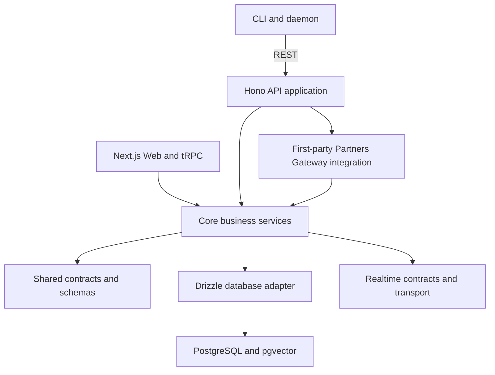

# Task Weaver 设计文档

[English](design.md)

> 人机协作的项目管理工具 —— 让人类和 AI Agent 在同一个平台上协同工作。

## 1. 项目概述

Task Weaver 是一个面向人机协作场景的项目管理平台。人类通过 Web UI 操作，AI Agent 通过 REST API 接入，两者是平等的参与者，共享同一套数据和业务逻辑。

### 1.1 核心能力

- **项目管理**：创建和管理多个项目，每个项目有独立的需求、任务集和看板视图
- **需求管理**：需求挂在项目下，任务必须挂在需求上，需求可与文档双向关联
- **任务系统**：完整的任务生命周期管理，支持状态流转、依赖关系、备注评论
- **知识库**：支持全局文档和项目文档，文档间双向关联，文档与任务/需求多对多关联，文档版本管理
- **双重搜索**：精准关键词搜索 + 向量语义搜索
- **实时协作**：人类可实时查看 AI Agent 的工作进展，反之亦然
- **MCP 管理**：注册和管理第三方 MCP Server，代理调用其工具
- **Memory 系统**：AI Agent 的记忆存储与检索
- **Skills 管理**：技能文件导入 DB，按 intent 语义搜索
- **Daemon 系统**：CLI daemon 注册、心跳、任务 claiming/locking
- **Webhooks**：事件驱动的外部通知，支持重试

### 1.2 核心原则

- **接口平等**：人和 AI 走同一套业务逻辑，不存在"二等公民"
- **灵活不死板**：任务状态允许自由跳转，不强制线性流转
- **关联即价值**：文档与文档、文档与任务之间的双向关联构成知识网络
- **渐进复杂度**：单 PostgreSQL 即可运行，按需扩展

---

## 2. 系统架构

### 2.1 整体架构图



### 2.2 Monorepo 结构

```text
task-weaver/
├── apps/
│   ├── web/                    # Next.js frontend and Web composition
│   ├── api/                    # Hono API and module lifecycle composition
│   └── cli/                    # CLI and daemon
├── packages/
│   ├── contracts/              # Shared schemas, types, and event contracts
│   ├── core/                   # Business services and default runtime adapters
│   ├── db/                     # Drizzle schema, Core and extension migrations
│   ├── partners-gateway/       # Independently composed reference module
│   └── realtime/               # Realtime event types and pub/sub transport
├── skills/                     # Agent Skills packages
├── docs/                       # English documents and separate translations
├── turbo.json                  # Turborepo configuration
├── pnpm-workspace.yaml         # pnpm workspace configuration
└── package.json
```

### 2.3 技术选型

| 层级 | 技术 | 选型理由 |
|------|------|----------|
| 构建 / Monorepo | Turborepo + pnpm | 智能缓存、并行构建、严格依赖隔离 |
| 后端框架 | Hono | TypeScript 原生、极快、运行时无关 |
| 数据库 | PostgreSQL + pgvector | JSONB 存文档、tsvector 全文搜索、pgvector 向量搜索、LISTEN/NOTIFY 实时通知 |
| ORM | Drizzle ORM | 类型安全、SQL-like API、轻量无引擎二进制 |
| 前端 API | tRPC v11 | 端到端类型安全、SSE 订阅支持实时更新 |
| 通用 API | REST (Hono Routes) | 通用兼容，任何语言/工具均可调用 |
| GraphQL | Hono route | 灵活查询 |
| 前端框架 | Next.js 16 (App Router) | RSC 性能优化、文件路由 |
| UI 组件 | shadcn/ui + Tailwind CSS | 代码可控、无许可证限制、基于 Radix 可访问性原语 |
| 数据校验 | Zod | tRPC/REST 共用同一套 Schema |
| 文档编辑 | Markdown (CodeMirror + react-markdown + Mermaid) | AI-friendly, 支持 `[[wiki-link]]`、Mermaid 图表 |
| 向量 Embedding | OpenAI text-embedding-3-small 或可替换 | 1536 维，成本低 |

---

### 2.4 单一主应用与延期插件规划

Task Weaver 采用单一主应用，不再维护独立的 CE/Pro 产品架构。
共享 Contracts、Core、数据库、Realtime 与 Partners Gateway 包仍服务于现有功能。
旧版进程内模块 SDK、默认许可证/授权端口、Web 扩展注册器和扩展迁移执行器已移除。
API 与 Web 直接装配内置功能，数据库仅执行现有 Core 迁移；API key 校验与 actor 语义保持不变。
原有授权端口默认允许所有请求，不构成已实施的角色权限系统。

Partners Gateway 保留状态/健康接口、worker 生命周期、幂等重试与租约恢复。
`pnpm test:gateway-postgres` 验证一次性 PostgreSQL 与 Gateway HTTP/SSE 通信；
`pnpm test:gateway-live` 需要显式提供测试地址和凭据。默认 worker 不自动调用 AI 模型。

插件生态仅列入低优先级草案，当前不实施，也不规划基础功能扩展。
未来第三方插件必须在独立进程或容器中隔离运行，不能获得宿主数据库连接、任意 SQL
或其他插件数据权限；通过宿主受控接口和专属存储服务访问数据，权限取插件授权与
用户/项目授权的交集。前端采用隔离容器与受限桥接，不暴露宿主令牌。
权限声明本身不是隔离措施，不能把旧的可信官方代码模型当作第三方安全模型。

参见[架构调整](architecture-transition.md)、[延期插件路线](plugin-roadmap.md)
与[版本化包](ce-packages.md)。

## 3. 数据模型

### 3.1 ER 关系总览

```text
┌──────────┐       ┌────────────────┐       ┌──────────────┐
│ projects │──1:N──│ requirements   │──1:N──│    tasks      │
└────┬─────┘       └───────┬────────┘       └──────┬───────┘
     │                     │                       │
     │              ┌──────┴───────┐         ┌─────┴──────┐
     │              │ doc_req_links│         │  comments  │
     │              └──────────────┘         ├────────────┤
     │                                       │  task_deps │
     │                                       ├────────────┤
     │                                       │ task_notes │
     │                                       ├────────────┤
     │                                       │ status_log │
     │                                       └────────────┘
     │
     └──1:N──┌──────────────┐    ┌──────────────┐
             │  documents   │    │   memories   │
             └──────┬───────┘    └──────────────┘
                    │
              ┌─────┴──────┐    ┌──────────────────┐
              │  doc_links │    │ document_versions│
              └────────────┘    └──────────────────┘

Other project-visible or independent entities:
┌──────────────┐  ┌──────────────┐  ┌──────────────┐  ┌──────────────┐
│  mcp_servers │  │   daemons    │  │   webhooks   │  │   api_keys   │
├──────────────┤  └──────────────┘  ├──────────────┤  └──────────────┘
│  mcp_tools   │                    │  deliveries  │
├──────────────┤                    └──────────────┘
│mcp_tool_calls│
└──────────────┘
```

核心约束：
- requirements 必须关联 project
- project-scoped tasks must link to a requirement under the same project; personal tasks use `scope = personal` and owner fields instead of fake projects/requirements
- documents 可以不关联 project（全局文档），也可以关联（项目文档）
- documents 有 `docType` 区分类型：`requirement` / `design` / `meeting` / `guide` / `reference` / `skill` / `other`
- document_versions 实现乐观并发控制的版本历史
- retrieval assets（MCP tools、Skills、Memories）统一使用 global/project/personal/actor/node/client scope 语义

### 3.2 核心表

详细字段定义见 `packages/db/src/schema/` 下各文件。以下列出主要表和关键字段：

| 表 | 文件 | 说明 |
|------|------|------|
| `projects` | `projects.ts` | 项目。status: `active` / `archived` |
| `requirements` | `requirements.ts` | 需求。status: `draft` / `approved` / `in_progress` / `in_review` / `ready_to_merge` / `done` / `cancelled` / `archived` |
| `tasks` | `tasks.ts` | 任务。`scope`: `project` / `personal`; status: `todo` / `in_progress` / `in_review` / `done` / `cancelled` |
| `task_status_log` | `tasks.ts` | 状态变更日志 |
| `task_dependencies` | `tasks.ts` | 任务依赖（`blocks` / `related`） |
| `requirement_dependencies` | `requirements.ts` | Requirement-to-requirement dependencies (`blocks` / `related`) |
| `execution_slices` | `requirements.ts` | Ordered AI execution slices inside a requirement lane |
| `task_comments` | `tasks.ts` | 任务评论 |
| `task_notes` | `tasks.ts` | 任务备注 |
| `documents` | `documents.ts` | 知识库文档，含 `docType` / `version` / `summary` / `keywords` |
| `document_versions` | `documents.ts` | 文档版本历史 |
| `document_links` | `documents.ts` | 文档↔文档双向关联 |
| `document_task_links` | `documents.ts` | 文档↔任务多对多 |
| `document_requirement_links` | `documents.ts` | 文档↔需求多对多 |
| `memories` | `memories.ts` | AI 记忆。类型：`user` / `feedback` / `project` / `reference` / `other` |
| `mcp_servers` | `mcp-servers.ts` | 第三方 MCP Server 注册表 |
| `mcp_tools` | `mcp-servers.ts` | 从 MCP Server 同步的工具列表 |
| `mcp_tool_calls` | `mcp-servers.ts` | MCP 工具调用记录 |
| `skill_packages` | `skill-packages.ts` | Filesystem-shaped skill package identity and scope metadata |
| `skill_package_versions` | `skill-packages.ts` | Immutable package version manifests and storage summaries |
| `skill_package_storage_objects` | `skill-packages.ts` | Server-owned storage object metadata for archives and files |
| `skill_package_files` | `skill-packages.ts` | Per-version file manifest with hashes, readability, executability, and indexed document links |
| `daemons` | `daemons.ts` | CLI daemon registry (heartbeat, capabilities, active workers) |
| `requirement_claims` | `requirements.ts` | Distributed leases for daemon-owned requirement lanes |
| `repositories` | `repositories.ts` | Instance catalog identity, safe endpoints, visibility, and non-secret auth policy |
| `requirement_repositories` | `repositories.ts` | Requirement workspace membership and per-repository delivery lifecycle |
| `task_repositories` | `repositories.ts` | Optional Task scope hints into the Requirement workspace |
| `schedules` | `schedules.ts` | One-off and recurring task generation templates |
| `schedule_runs` | `schedules.ts` | Idempotent schedule occurrences and generated task links |
| `ti_model_configs` | `ti-agent.ts` | User-scoped Ti provider/model configuration and default model selection |
| `ti_agent_policies` | `ti-agent.ts` | Owner-scoped Ti execution policy, limits, and safety controls |
| `ti_agent_runs` | `ti-agent.ts` | Bounded server-side Ti execution queue, leases, and audit results |
| `assistant_conversations` | `assistant.ts` | Contextual Ti assistant dialog sessions linked to project/requirement/task/schedule surfaces |
| `assistant_messages` | `assistant.ts` | Assistant dialog messages with optional context snapshots and Ti run metadata |
| `assistant_actions` | `assistant.ts` | Structured assistant action proposals, approvals, execution results, and audit links |
| `webhooks` | `webhooks.ts` | Webhook 配置（URL、事件、密钥） |
| `webhook_deliveries` | `webhooks.ts` | Webhook 投递记录（含重试） |
| `api_keys` | `api-keys.ts` | API Key 管理 |
| `activity_log` | `activity.ts` | 全局操作日志 |

---

### 3.3 助理对话基础

上下文助理是项目管理协作助手，使用有边界的 Task Weaver 上下文和 Ti 执行记录。对话单独存储，避免探索性交流污染任务评论；重要结果仍可通过操作目标和活动日志关联到任务。

- `assistant_conversations` 存储会话及其 UI 上下文：全局、项目、需求、任务或日程。
- `assistant_messages` 存储用户、助理、系统和工具消息，以及可选的上下文快照和 Ti 模型元数据。
- `assistant_actions` 存储结构化操作提案，包括创建或更新任务、修改日程、排队 Ti 运行、添加评论或备注、起草文档。
- 提案起始状态为 `proposed`。人工批准后进入 `approved` 和 `executing`；系统记录执行状态、结果、校验错误及目标实体，便于重放和排查。自动执行默认关闭，只有策略明确允许时才能启用。
- 第一批可批准的操作包括创建任务、更新任务状态或优先级及内容、创建或暂停日程、排队 Ti 运行、添加任务评论或备注，以及创建供审查的文档草稿。
- 管理工作流可针对项目健康、过期任务、Ti 运行失败、日程维护、需求下一步和个人收件箱返回只读分析及待批准的操作提案。
- 助理自动维护由归属者范围的 Ti 策略控制，默认关闭。策略包含试运行或正式运行、操作白名单、每日操作上限、超时与重试，以及将不确定操作转交审查。
- `buildAssistantContext` 从项目状态、当前对象、日程、活动、文档、记忆、MCP 工具、Ti 策略、失败运行和近期对话中构建有界上下文，并在传给模型前限制条数、截断文本和遮盖常见密钥字段。

---

### 3.4 定时与周期任务模型

定时工作由模板和每次触发的运行记录组成：

- `schedules` 存储单次或周期任务的持久定义。
- `schedule_runs` 存储每次计划触发、幂等键、生成任务的关联，以及执行和审计结果。
- 生成的工作仍是普通 `tasks` 记录，因此沿用任务状态、认领、Daemon、实时事件、Webhook 和活动日志流程。

#### 日程模板

| 字段 | 含义 |
|------|------|
| `projectId` | 项目任务目标；为未来个人日程保留空值。 |
| `requirementId` | 生成项目任务时使用的需求；允许为空，以便日程在需求调整后继续存在。 |
| `targetScope` | `project` 或 `personal`；项目任务挂在需求下，个人任务归属个人。 |
| `kind` | `one_off` 或 `recurring`。 |
| `status` | `active`、`paused` 或 `archived`；只有已到 `nextRunAt` 的活跃日程可被调度。 |
| `timezone` | 用来解释本地日历规则的 IANA 时区。 |
| `startsAt` / `endsAt` | 开始及可选结束边界，均存为 UTC 时间点。 |
| `nextRunAt` | 预先计算的下一次 UTC 触发时间。 |
| `recurrenceSyntax` / `recurrenceRule` | 周期日程以 RRULE 为规范格式；可接受 Cron 作为导入兼容格式，但应规范化或明确标记。 |
| `taskTitle` / `taskDescription` / `taskPriority` | 复制到生成任务的模板字段。 |
| `autoRun` | 生成任务是否立即进入可执行队列，而非只供人工审查。 |
| `assignedExecutor` / `assignedExecutorType` | 可选的执行者，用于明确分配任务，避免服务端 Agent 任意认领需求。 |
| `requestedTiProvider` / `requestedTiModel` | 传给生成运行的 Ti 模型请求；执行层处理回退到用户默认模型。 |

#### 运行记录

每次运行由 `(scheduleId, plannedFor)` 唯一标识，避免调度器竞争或重启时重复生成任务。`plannedFor` 是按模板时区与周期规则计算后的 UTC 时间点。

| 状态 | 含义 |
|------|------|
| `pending` | 已保留触发机会，但尚未生成任务或终结结果。 |
| `created` | 已生成普通任务，并通过 `generatedTaskId` 关联。 |
| `skipped` | 按过期或补跑策略跳过。 |
| `failed` | 已尝试触发，但未能创建或分配工作。 |
| `cancelled` | 人工或系统在生成前取消。 |

运行记录同时保存请求的 Ti 模型与实际使用的模型。请求值在生成时从模板复制；执行组件在检查模型可用性和回退后填写实际值。即使用户日后改变默认模型，审计记录也保持稳定。

#### 周期规则

RRULE 是首选存储格式，因为它更适合表达带时区的本地日历周期。Cron 适合运维导入和简单服务端日程，但若未绑定 `timezone`，在时区与夏令时切换时含义不明确。

`nextRunAt` 始终存为 UTC。调度器应：

1. 在 `timezone` 中解释 `startsAt`、`endsAt` 和周期规则。
2. 选择严格晚于上次完成或跳过时间的下一次触发。
3. 将其转换为 UTC 并写入 `nextRunAt`。
4. 单次日程已执行、规则耗尽或日程归档时，将 `nextRunAt` 置空。

补跑与过期策略和日程身份分离。后续策略需决定错过触发时是补齐全部、仅补最近一次、完全不补，还是写入 `skipped` 运行记录。

---

### 3.5 服务端 Ti Agent 边界

Ti 是 Task Weaver 的服务端 Agent：一个在受限范围内执行已分配自动化任务的 Worker，其背后是私有执行适配器。它与 `tw daemon` 不是同一执行路径，不能任意认领需求或项目编码工作。

允许的工作：

- 明确分配给服务端 Agent 身份（目前为 `task-weaver:ti-agent`）的任务。
- 生成任务明确分配给该身份的日程运行。
- 提醒、摘要、元数据维护和安全的已注册工具调用等轻量自动化。

禁止的工作：

- 与需求 Daemon 争抢未分配的项目任务。
- 未经明确任务或运行授权，任意修改仓库。
- 将机器全局 Ti 凭据当作产品授权模型。
- 在缺少 Task Weaver 所有的超时、速率限制、日志和隔离机制时无人值守地运行 Ti。

产品命名：

- 稳定内部身份：`task-weaver:ti-agent`。
- 默认显示名称：`Ti Agent`。
- UI 类别：`Assigned Automations`。
- 显示文案可以变化，不应成为任务分配、审计或策略记录的架构依赖。

#### Ti 模型配置

`ti_model_configs` 存储用户或 Agent 归属者可使用的 Ti 模型：

| 字段 | 含义 |
|------|------|
| `ownerId` / `ownerType` | 配置的用户或 Agent 归属者。 |
| `provider` / `model` | Ti 提供商与模型标识。 |
| `label` | 可选显示名称。 |
| `apiKeyRef` | 凭据引用，而非明文密钥。 |
| `credentialStatus` | `unknown`、`valid`、`invalid` 或 `missing`；后两者不可用。 |
| `enabled` | 禁用后不可选择，也不可用于回退。 |
| `isDefault` | 每个归属者仅有一个默认模型，由部分唯一索引保证。 |
| `capabilities` / `costMetadata` | 可选能力与成本元数据。 |

运行时优先选择已配置、启用且凭据可用的请求模型；否则回退到归属者的默认可用模型，再回退到第一个可用模型。如果没有请求模型，也没有可用模型，入队前拒绝执行。

#### Ti Agent 运行

`ti_agent_runs` 是执行队列与审计记录。每次运行至少关联一个明确目标：`taskId` 或 `scheduleRunId`。

| 状态 | 含义 |
|------|------|
| `queued` | 等待服务端 Agent 获取。 |
| `running` | Worker 已取得租约，可执行 Ti。 |
| `succeeded` | 执行成功。 |
| `failed` | 当前尝试失败。 |
| `in_review` | 结果不确定或涉及敏感策略，等待人工审查。 |
| `cancelled` | 完成前取消。 |

每次运行记录请求与实际模型、回退原因、可选 Ti 会话 ID、事件日志、结果摘要、错误、重试次数、成本、租约归属、到期时间及各时间戳。初始实现仅入队和审计；实际执行循环必须置于隔离边界之后。

#### Ti 执行策略

`ti_agent_policies` 按归属者配置，默认关闭，控制能否取得队列运行以及执行范围：

| 字段 | 含义 |
|------|------|
| `enabled` | 未启用时禁止 Worker 获取运行。 |
| `executionMode` | `disabled`、`dry_run` 或 `live`；试运行只记录，不调用 Ti。 |
| `maxConcurrentRuns` | 该归属者或 Agent 的最大活跃租约数。 |
| `dailyRunLimit` / `monthlyRunLimit` | 硬性运行次数上限；零表示不允许运行。 |
| `runTimeoutSeconds` | Worker 进程的最大执行时间。 |
| `defaultMaxRetries` | 创建运行时默认复制的重试预算。 |
| `toolAllowlist` / `toolDenylist` | 执行包装器的工具策略；正式执行必须先强制执行。 |

CLI Worker 路径 `tw ti worker run-once` 获取一个待运行记录，根据明确分配的任务或日程构建有界提示，并用解析后的提供商和模型试运行或调用私有执行器。Worker 通过 Ti 运行记录保存结构化事件、输出或错误摘要、实际模型及终态。

---

## 4. 检索作用域模型

Agent 在运行时发现的 MCP 工具、Skills 和 Memories 使用同一套作用域词汇，保证 CLI、REST、tRPC 和 UI 的搜索行为可预测。

### 4.1 作用域

| 作用域 | 含义 | 当前存储方式 |
|--------|------|--------------|
| `global` | 跨项目可见，但仍受对象自身访问规则约束 | 文档、记忆和 MCP Server 的 `projectId = null` |
| `project` | 属于一个项目；该项目活跃时优先显示 | `projectId = <project-id>` |
| `personal` | 用户拥有的私有工作区，存放收件箱任务、技能、记忆和 MCP 资源 | `personalOwnerId` 与 `personalOwnerType`，且 `projectId = null` |
| `actor` | 属于某个人或 Agent，或与其最相关 | 记忆的 actor/entity 字段 |
| `node` | 只对同一机器或节点上的 Agent 可见 | MCP stdio 的 `scope = local` 与 `nodeId` |
| `client` | 只对一个客户端进程或会话可见 | MCP stdio 的 `scope = private` 与 `clientId` |

作用域可组合。例如，项目范围的本地 stdio MCP Server 只有在项目过滤器与节点可见性均匹配时才可见。

### 4.2 默认搜索语义

请求包含 `projectId` 时，默认同时返回该项目和全局对象；分数相近时项目对象排序更靠前。端点支持时，可用 `includeGlobal=false` 严格限制为项目对象。个人对象只有在 `includePersonal=true` 且 `personalOwnerId`、`personalOwnerType` 匹配时才返回。

请求不含 `projectId` 时，默认只返回全局对象。个人对象仍需显式开启并指定归属者。项目对象不能泄漏到无项目上下文的发现结果，个人对象不能跨归属者泄漏。

REST 搜索端点统一返回 `{ items: [...] }`，供机器读取。组合搜索为兼容性保留 `tasks`、`requirements`、`documents` 分组，同时在 `items` 中提供带类型的结果。

### 4.3 对象映射

- **Skills：** 使用 `docType = skill` 的文档。无项目或个人归属者的是全局技能；设置 `projectId` 的是项目技能；设置个人归属者的是个人技能。导入或更新的身份包含有效作用域，因此同名技能在不同作用域下彼此独立。
- **Skill packages：** 面向文件系统的分发记录。`skill_packages` 管理包身份、全局/项目/个人作用域、状态、入口路径、清单和可选的 `primaryDocumentId`；`skill_package_versions` 记录不可变的上传或导入版本；`skill_package_files` 记录规范化相对路径、哈希、大小、类型、可读/可执行标记、存储对象关联及可选的 `indexedDocumentId`。文档仍是可搜索的知识单元，包则是分发与本地落盘的事实来源。
- 包分发以清单为依据：客户端获取文件元数据、哈希、可执行标记和文件内容，校验哈希后落盘。维护 API 可检查存储对象健康并重建可读文件的搜索索引。服务端存储和提供包内容，不执行包自带脚本或二进制。
- **Memories：** 使用可空的 `projectId` 和可选个人归属字段。actor 与实体过滤器在选定的全局/项目/个人集合内缩小相关范围；actor 作用域表示身份记忆，personal 作用域表示用户工作区。
- **MCP servers/tools：** 使用可空的 `projectId`、可选个人归属字段与传输可见性。非 stdio Server 按作用域字段决定是全局、项目还是个人对象；stdio Server 还必须在 `private` 作用域匹配 `clientId`，或在 `local` 作用域匹配 `nodeId`，且过期后不再返回。

### 4.4 隔离规则

- 项目对象仅在请求相同 `projectId` 时可见。
- `includeGlobal=true` 时，项目搜索可以包含全局对象。
- 个人对象需要显式请求且归属者匹配。
- 本地 stdio MCP 共享需要明确同意和稳定的 `nodeId`。
- 私有 stdio MCP Server 只对注册它的 `clientId` 可见。
- 过期的 stdio MCP Server 不参与发现，即使项目作用域匹配。

---
## 5. 任务状态机

### 5.1 状态定义

| 状态 | 含义 |
|------|------|
| `todo` | 待办，尚未开始 |
| `in_progress` | 进行中 |
| `in_review` | 审查中 |
| `ready_to_merge` | 审查通过，等待合并 |
| `done` | 已完成 |
| `cancelled` | 已取消（终态） |

### 5.2 流转规则

**核心原则：允许自由跳转，不强制线性流程。唯一限制：`cancelled` 不可再流转。**

每次状态变更：
1. 更新 `tasks.status`
2. `done` 时自动记录 `completedAt`，离开 `done` 时清空
3. 写入 `task_status_log`
4. 写入 `activity_log`
5. 通过 PG NOTIFY 发送实时事件
6. 触发 Webhook 投递

---

## 6. 知识库与搜索

### 6.1 文档分类

- **全局文档**（`projectId = null`）：不属于任何项目，全局可见
- **项目文档**（`projectId` 指定）：归属特定项目
- **文档类型**（`docType`）：`skill` 类型的文档即为 Skills

### 6.2 双向关联

- **文档↔文档**：通过 `document_links`，支持 `[[wiki-link]]` 语法自动解析
- **文档↔任务**：通过 `document_task_links`（`references` / `documents` / `output`）
- **文档↔需求**：通过 `document_requirement_links`

### 6.3 版本管理

文档通过 `version` 字段实现乐观并发控制，每次变更记录到 `document_versions` 表，支持回滚。

### 6.4 搜索系统

| 模式 | 实现 | 说明 |
|------|------|------|
| `keyword` | PostgreSQL `tsvector` / `tsquery` | 精准全文搜索，触发器自动维护 |
| `semantic` | pgvector + Embedding | 向量语义搜索 |
| `hybrid` | 两者加权融合 | 默认模式，关键词 0.4 + 语义 0.6 |

---

## 7. 接入方式

```text
┌──────────────────────────────────────────────────────────────────────┐
│                         Access channels                              │
├──────────────┬──────────────────┬───────────────┬────────────────────┤
│   Web UI     │   AI Agent       │  CLI Daemon   │  Tools and scripts │
│   (human)    │   (REST API)     │  (REST API)   │  (for example curl)│
├──────────────┼──────────────────┼───────────────┼────────────────────┤
│   tRPC       │   REST API       │   REST API    │   REST API         │
│   typed      │  + Skills guide  │  + task claim │   JSON            │
└──────────────┴──────────────────┴───────────────┴────────────────────┘
```

- **Web UI** → Next.js 前端通过 tRPC 调用 API
- **AI Agent** → 通过 REST API（Bearer Token 认证）+ Skills 文件指引使用方式
- **CLI Daemon** → 通过 REST API 注册、心跳、认领任务
- **第三方 MCP Server** → Task Weaver 作为 MCP 客户端，通过 MCP Pool 连接和调用外部 MCP Server 的工具

---

## 8. 第三方 MCP Server 管理

Task Weaver 可以注册和管理外部 MCP Server，作为工具的聚合代理：

- **注册**：记录 MCP Server 的连接信息（stdio / sse / streamable-http）
- **连接池**（`mcp-pool`）：维护到各 MCP Server 的长连接，支持空闲回收
- **工具同步**：从已连接的 MCP Server 拉取工具列表，缓存到 `mcp_tools` 表
- **代理调用**：通过 Task Weaver API 代理调用第三方 MCP Server 的工具，记录调用历史
- **TTL & 状态管理**：支持 `clientId` + `expiresAt` + `ttl` 实现临时注册和自动过期

---

## 9. Daemon 系统

CLI Daemon 是自主 AI Agent 的运行载体。它向 API 注册、声明本地 AI 工具能力、获取工作、启动 AI CLI，并向 Task Weaver 报告存活状态与进度。

- **注册：** `tw daemon start` 创建 Daemon 记录，声明 `codex`、`claude`、`agy` 等能力。
- **心跳：** 发送进程心跳和各 Worker 的需求认领心跳。
- **需求工作通道：** Worker 认领需求级分布式租约，而非争抢孤立任务。
- **执行切片：** 一个需求可拆成有序切片；每片启动一次上下文有界的 AI CLI，带独立模型档位与交接摘要。
- **模型控制：** 将模型档位映射到具体 Codex 模型和 `model_reasoning_effort`；不支持的工具忽略思考强度映射。
- **本地提示控制：** `--prompt` 与 `--prompt-file` 为 Worker 注入只保留在本机的提示，不把机器特定指引写入 API。
- **复合工作区隔离：** 每个切片收到冻结、无密钥的清单；需求关联的每个仓库各有隔离的分支 worktree。同节点共享基础检出，不同需求分支相互隔离。
- **独立收尾：** Agent 将文件改动留在 worktree；Daemon 负责提交、推送、按提供商检测或创建 PR、记录各仓库交付状态、部分重试、审查评论和需求终态路由。
- **审查与合并：** `tw daemon review` 综合本地检查与规范化的 GitHub/Gitea 检查和批准，并用提交哈希约束结构化决策。`tw daemon merge` 根据有效策略选择提供商、直接或人工合并；只有全部仓库进入终态，需求才能标记 `done`。
- **Worker 可见性：** Daemon 状态包含 `activeWorkerStates`，供 Web Daemons 页面显示 Worker 卡片与任务路线。
- **状态：** Daemon 使用 `idle`、`busy`、`offline`；需求与任务状态仍是项目的持久状态。

### 需求通道调度

1. Worker 调用 `POST /api/v1/daemons/:id/apply-requirement`。
2. 服务端挑选至少有一个可执行 `todo` 任务的需求。
3. 服务端使用 Daemon 的 actor ID 原子地创建或续租 `requirement_claims`。
4. 如有执行切片，挑选下一可执行切片，并将首个选中任务改为 `in_progress`；否则返回整个需求的任务路线。
5. Daemon 冻结需求仓库集合，为每个仓库准备隔离 worktree，写入复合清单，并在工作区根目录为切片启动 AI CLI。
6. Agent 顺序处理切片任务并留下交接摘要。
7. 退出后，Daemon 将切片标记为 `done` 或 `in_review`、释放需求认领，并在需要时执行状态兜底路由。
8. 当需求下所有任务为 `done` 或 `cancelled`，Daemon 独立收尾每个仓库：必要时提交改动、推送分支、尝试提供商支持的 PR 操作、记录结果；一个仓库失败时保留其他仓库的成功结果，写汇总评论并将需求转为 `in_review`。

需求是分支和认领单位，切片则限制每次 Agent 会话的上下文。不同需求仍可在同一项目内由多个 Worker 并行处理。

Daemon 收尾以审查为目标。成功推送且得到 PR URL 时，人工有明确的审查入口。即使没有 Forge 能力，通用 Git 仍可使用；没有改动或 Forge 无法访问时，Daemon 应记录每个仓库的准确结果。提交、推送、审查和合并失败都附在对应的需求仓库关联上，可分别重试。

审查和合并调度复用服务端拥有的需求通道。审查 Worker 调用 `POST /api/v1/daemons/:id/apply-review`，服务端认领 `in_review` 需求并返回仓库关联。审查 Daemon 分别处理各分支；通过后需求进入 `ready_to_merge`。冲突、检查失败或审查发现会创建带仓库标签的后续任务，并将需求退回 `in_progress`。

合并 Worker 调用 `POST /api/v1/daemons/:id/apply-merge`，获取未被认领的 `ready_to_merge` 需求。提供商模式用带预期 head 提交约束的 Forge 合并 API；直接模式推送本地合并后的基准分支；人工模式不进入 Daemon 自动获取，而显示操作 URL。规范化的 Forge 快照通过带版本校验的幂等端点同步。已合并快照为终态；关闭或重新打开的 PR 按情况返回审查；head 变化会使之前的审查运行失效，须重新批准。

### 需求依赖

`requirement_dependencies` 表示同一项目内需求之间的依赖：

- `requirement_id` 是下游需求。
- `depends_on_requirement_id` 是上游需求。
- `type` 为 `blocks` 或 `related`，只有 `blocks` 影响调度。
- 自依赖、跨项目依赖、重复关联和依赖环均被拒绝。
- 阻塞需求处于 `done` 或 `cancelled` 时，下游解除阻塞。
- 删除需求时，外键级联删除依赖记录。

Daemon 调度会跳过存在未完成阻塞依赖的下游需求。直接认领需求也在事务内检查阻塞，不能绕过调度获取无效工作通道。

### 需求认领

`requirement_claims` 与 `task_claims` 的语义一致：

- 每个需求只允许一个活跃认领，以 `requirement_id` 唯一索引保证。
- 认领保存 `expiresAt` 和 `heartbeatAt`。
- 同一持有者可续租，不同持有者会遇到冲突。
- 只有持有者可发送心跳或释放认领。
- 获取和列出认领前清理过期记录。
- 需求进入 `done`、`cancelled` 或 `archived` 时自动释放活跃认领。

交互式或人工任务协调仍使用 `task_claims`。Daemon 使用需求认领以拥有完整通道并避免重复加载上下文。

### Daemon Web 页面

Web Daemons 页面显示：

- Daemon 名称、ID、状态、能力和距上次心跳的时间。
- 活跃 Worker 通道。
- 当前需求的 ID、标题、状态和分支。
- 当前活跃任务。
- 各任务状态组成的需求路线。
- Worktree 路径和租约是否新鲜。

---
## 10. Memory 系统

AI Agent 的结构化记忆存储：

- **类型**：`user` / `feedback` / `project` / `reference` / `other`
- **作用域**：可关联到项目，也可以是全局记忆
- **实体关联**：可选关联到具体的 project / requirement / task / document
- **过期机制**：支持 `expiresAt` 自动过期
- **搜索**：支持按类型、标签、关键词检索

---

## 11. 实时系统

```text
Write (REST API / tRPC)
         │
         ▼
   @task-weaver/core business logic
         │
         ├──► Write to PostgreSQL
         │
         ├──► pg_notify('realtime_events', ...)
         │
         └──► webhookService.deliverEvent(...)
                    │
                    ▼
              Webhook delivery (HTTP POST + retry)

PostgreSQL NOTIFY path:
   Hono API / Next.js listens for notifications
         │
         ▼
   tRPC SSE → browser UI updates
```

---

## 12. 认证与权限

| 类型 | 认证方式 | 说明 |
|------|----------|------|
| 人类用户 | Session / JWT（Web UI 登录） | 通过 Web 前端管理 |
| AI Agent | API Key（`Authorization: Bearer tw_xxx`） | 每个 Agent 独立 Key |
| CLI Daemon | API Key + daemon 注册 | 注册后通过 REST API 操作 |

---

## 13. 开发环境

### 依赖

- Node.js >= 20
- pnpm >= 9
- PostgreSQL >= 16（需安装 pgvector 扩展）

### 启动

```bash
pnpm install          # Install dependencies
pnpm dev              # Start all services in parallel
pnpm build            # Build
pnpm lint             # Lint
pnpm typecheck        # Type-check
```

### 端口约定

| 服务 | 端口 | 说明 |
|------|------|------|
| Next.js Web | 3000 | 前端应用 |
| Hono API | 3001 | API 服务（tRPC + REST + GraphQL） |
