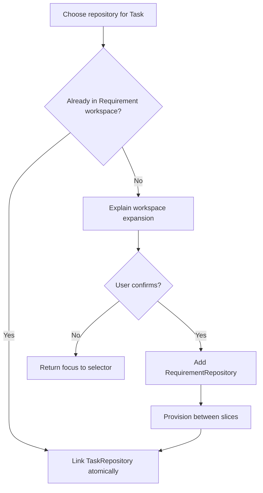

# Repository Product and Interaction Specification

Status: accepted implementation contract

## Information architecture

- `/repositories` is a top-level navigation destination and catalog.
- `/repositories/[repositoryId]` is the stable detail route.
- Repository results appear in global search and the command/navigation palette.
- Project pages show repository summaries derived from linked Requirements; there is no Project repository setting.
- Requirement detail owns workspace association and delivery state. Task detail owns optional scope hints selected from its Requirement repositories.

Primary terminology:

- **Repository workspace**: all repositories linked to a Requirement.
- **Repository scope: unspecified**: a Task has no explicit hints and the agent may use the full Requirement workspace.
- **Access readiness**: non-secret readiness for the current actor and node. It is not a guarantee that a push will succeed.
- **Partial delivery**: some repositories succeeded while others remain incomplete or failed.

Never label an unlinked Task as “no repository access.”

## Catalog URL state

The URL is the source of truth for shareable state:

`/repositories?q=&provider=&host=&status=active&tags=&sort=relevance&page=1&pageSize=25&view=table`

- Search is debounced by 250 ms and uses `replaceState` while typing; committed filters, page changes, sorting, and view changes use `pushState`.
- Unknown values are ignored with a non-blocking notice. Repeated tags are normalized and sorted.
- Changing search or filters resets page to 1. Back/forward navigation restores controls and focus without refetch loops.
- Stable sorts are `relevance`, `recently-used`, `usage`, `name`, and `updated`.

Desktop uses a table; compact widths use cards unless the user selected a view. Every result shows display name, canonical identity, provider/host, lifecycle, tags, usage signal, and the caller's readiness state. Long identities wrap or middle-truncate while the full value remains accessible.

## Catalog states

- Initial loading uses rows/cards with matching geometry and an accessible “Loading repositories” status.
- No repositories offers a create action and import/migration guidance.
- No results preserves filters and offers individual filter removal plus “Clear all.”
- Recoverable errors preserve prior results, explain retry, and restore focus to the triggering control.
- Permission denial distinguishes catalog visibility from local Git readiness.
- Pagination announces result range and has labelled previous/next controls.
- Active filter chips are keyboard removable and have explicit accessible names.

Create/edit validates identity as the user leaves each field, previews the canonical key, keeps Web/HTTPS/SSH endpoints separate, rejects credential-bearing URLs, and warns before submitting a likely duplicate. A `409` links to the existing repository. Archiving requires confirmation that lists linked Requirements and blocks when an active frozen slice depends on it.

## Repository detail

The header shows identity, lifecycle, provider capabilities, scoped readiness, and actions: edit, archive, open provider, inspect usage, and configure local access. Safe endpoints can be copied individually with an announced result.

Sections are:

1. identity and endpoints;
2. derived Project usage;
3. linked Requirements and per-repository delivery;
4. linked Tasks with Requirement context;
5. redacted recent activity.

The delivery table exposes branch, abbreviated commit with full accessible label, push, PR, review, merge, failure code, last attempt, and retry availability. A partial banner reports exact succeeded/incomplete counts. Retrying one repository never implies that successful repositories will run again.

## Requirement interactions

Requirement detail shows repository badges and a delivery table. Summary surfaces show up to two badges plus `+N`; the accessible label lists the total. Repository-free Requirements explicitly say “No repository workspace (planning/documentation only).”

Adding repositories opens a searchable multi-select dialog:

- options are grouped by recent, provider, and host;
- each option includes canonical identity and scoped readiness;
- selected and already-linked options cannot be duplicated;
- authorized users may create a Repository inline, returning focus to the new selected option;
- submit is one atomic association mutation with optimistic badges and rollback on error.

Removal is blocked with structured reasons when a Task references the Repository, a running slice manifest includes it, or delivery has advanced beyond pending. Inactive links with historical delivery require an explicit impact confirmation and are archived from future workspace manifests rather than erasing history.

## Task interactions

Task detail provides a searchable multi-select limited to Requirement repositories. Selecting a catalog result outside the Requirement opens an explicit two-step confirmation: “Add to Requirement workspace and link to this Task.” It states that the repository is provisioned between slices and cannot appear in a currently running process.

Board cards, list rows, search results, and execution views show up to two compact chips and `+N`. An empty set shows “Repository scope: unspecified” on detail and an accessible neutral icon/label on compact surfaces. TaskRepository never claims, mounts, or authorizes a repository.

## Focus, keyboard, and announcements

- All catalog, dialog, popover, and table actions are reachable in logical DOM order.
- Searchable multi-select follows combobox semantics: arrows move active option, Enter toggles, Escape closes, and selected chips have labelled remove buttons.
- Dialogs trap focus and return it to the invoker. Destructive confirmations place initial focus on Cancel.
- Mutation status uses an `aria-live=polite` region; terminal failures use `role=alert` without moving focus unexpectedly.
- Icon-only controls have explicit names and 44px touch targets. Status is never communicated by color alone.
- Responsive layouts preserve action names, delivery meaning, and access to filters instead of hiding essential state.

## Mutation and error contract

| Condition | Presentation and recovery |
| --- | --- |
| Validation | Inline field message tied with `aria-describedby`; focus first invalid field on submit. |
| Duplicate identity | Inline conflict summary with link to existing Repository; retain entered safe fields. |
| Stale version | Explain that data changed, refresh the record, and let the user reapply intent. |
| Permission denied | Keep metadata visible when allowed; disable action with permission explanation. |
| Readiness missing | Offer configuration guidance; never disclose another actor/node state. |
| Partial association | API mutation is atomic. If an external readiness refresh fails, keep the association and label readiness unknown. |
| Delivery failure | Show one repository's redacted reason and retry action without changing successful rows. |
| Network failure | Preserve edits and prior results; provide retry and announce recovery. |

Use toasts for completed background mutations and inline messages for conditions that require a decision. Optimistic updates must retain a rollback snapshot and announce both success and rollback.

## Interaction flow

## Analytics and audit events

Product analytics contains IDs and enums, never URLs or search text by default:

- `repository_catalog_viewed`, `repository_filter_changed`, `repository_result_opened`;
- `repository_created`, `repository_updated`, `repository_archived`;
- `requirement_repository_added`, `requirement_repository_removal_blocked`, `requirement_repository_removed`;
- `task_repository_linked`, `task_repository_unlinked`, `task_repository_workspace_expanded`;
- `repository_delivery_retry_requested`.

Operational audit additionally records actor, repository, Requirement/Task, policy revision where relevant, result code, and correlation ID. Both systems exclude credentials, helper identifiers, full commit messages, raw errors, and secret-bearing remote values.

## Acceptance scenarios

- Share a filtered page, navigate away, and use Back to restore the exact catalog state.
- Operate search, filters, create, association, removal, and retry entirely by keyboard and screen reader.
- Distinguish catalog permission, local readiness, and authenticated-operation failure.
- Add one repository to a Requirement and several Tasks; prevent removal until Task links are resolved.
- Show zero, one, many, long-name, archived, permission-denied, partial-delivery, stale-update, and retrying states at desktop and mobile widths.
- Confirm no UI, URL, analytics payload, error, or activity record exposes a credential or another principal's readiness.
